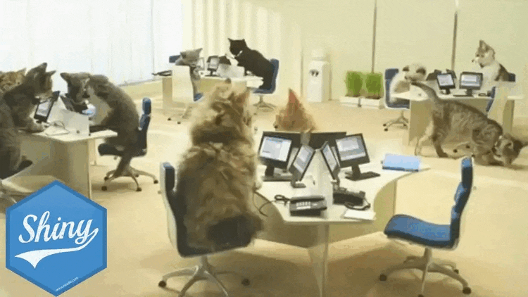

# Shiny Helpdesk

****tring...tring***: Thank you for calling `Shiny`, how may I help you?

---

Help is just an issue away!
---

Includes all the crowd favorite responses like:

- `Did you try restarting your Shiny App?`
- `Please allow me a moment to review your account.`
- `Please hold while I transfer you to the appropriate department.`
- `I'll be sure to pass along your feedback to the appropriate team.`
- `I understand your frustration, let me see what I can do.`

    And more...

---
So what is Shiny Helpdesk?

  
Find out 👇

  
  ### Shiny Helpdesk is simply a GitHub Actions bot that helps you manage your Shiny App issues.
  
  ## How does it work?
  - When a new issue is created, the bot will leverage AI to classify the issue with the closest matching label.
  - The bot will also respond to the issue with some code of the shiny app along with instructions that are specific to that issue.  

